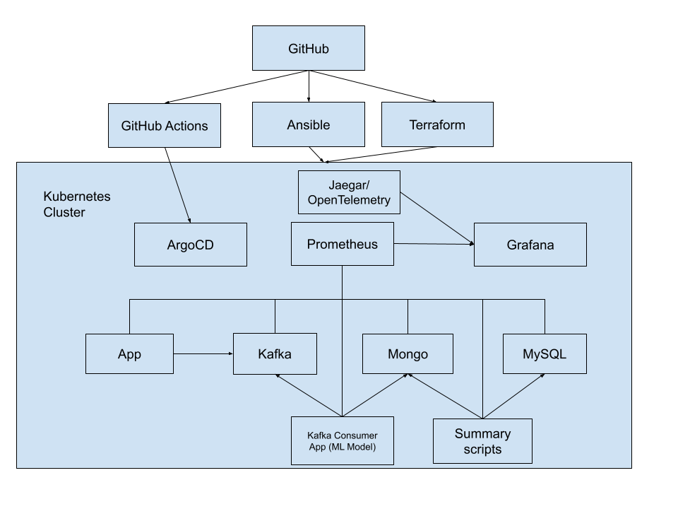

# SRE Capstone

<!--
Serve this Markdown file as a reveal.js presentation with:

    reveal-md Presentation.md --theme <theme_name>

(Slides are separated by `\n---\n`.)
-->

Alex Griffin  
Balin Warren  
Chadon Mathurin  
Daniel Nelson

---

### Goals and Objectives

- To build a system for detecting credit card fraud using machine learning
- Using sound engineering practices:
  - Implement using infrastructure as code (IaC)
  - Automated deployment and CI/CD
  - Horizontally scalable architecture
  - Instrumented and monitored

---

---

### Computing Infrastructure

- Running on self-hosted Proxmox server
- HPE ProLiant DL380 Gen9 Server
- Virtual machines provisioned with Terraform
- Kubernetes cluster configured with Ansible

---

### CI/CD

- K3s kubernetes cluster managed by ArgoCD
- Component services are defined as Dockerfiles and Kubernetes manifests
- GitHub Action workflows deploy  Kubernetes objects defined in git repository
- Build artifacts pushed to private container registry
- Secrets managed as GitHub secrets to avoid unwanted exposure of sensitive data
