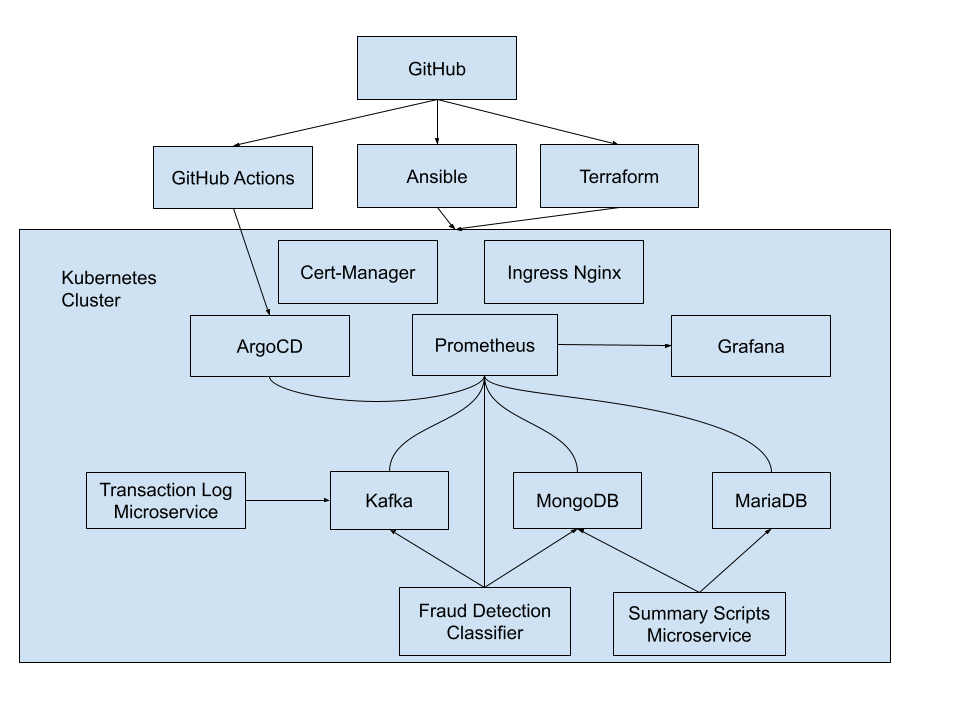

# Proactive Nonsense Crusher
## Credit Card Fraud Detection

Alex Griffin  
Balin Warren  
Chadon Mathurin  
Daniel Nelson

---

### Goals and Objectives

- To build a system for detecting credit card fraud using machine learning
- Using sound engineering practices:
  - Implement using infrastructure as code (IaC)
  - Automated deployment and CI/CD
  - Horizontally scalable architecture (microservices)
  - Instrumented and monitored

---



---

### Computing Infrastructure

- Running on self-hosted Proxmox server
- HPE ProLiant DL380 Gen9 Server
- Virtual machines provisioned with Terraform
- Kubernetes cluster configured with Ansible

---

### Docker and Kubernetes

- Docker is a container engine for developing, shipping, and running applications
  - More lightweight than virtual machines
- Kubernetes is a container orchestration platform for managing a computing cluster made up of many containerized services

---

### CI/CD

- K3s Kubernetes cluster managed by ArgoCD
- Component services are defined as Dockerfiles and ArgoCD Applications
- GitHub Action workflows deploy  Kubernetes objects defined in git repository
- Build artifacts pushed to private container registry
- Secrets managed by GitHub to avoid unwanted exposure of sensitive data

---

### Ingress Nginx

- Single point of entry into the cluster
- Routes domains and paths to services
- Cert-manager to provision, install, and rotate Cloudflare SSL certificates

---
### Ingesting Credit Card Transactions

- Credit card transaction dataset
  - https://www.kaggle.com/datasets/anurag629/credit-card-fraud-transaction-data/data
- Recorded information:

```txt
Transaction ID,Date,Day of Week,Time,Type of Card,Entry Mode,Amount,Type of Transaction,Merchant Group,Country of Transaction,Shipping Address,Country of Residence,Gender,Age,Bank,Fraud
#3577 209,14-Oct-20,Wednesday,19,Visa,Tap,£5,POS,Entertainment,United Kingdom,United Kingdom,United Kingdom,M,25.2,RBS,0

```

- Python script reads transaction log and feeds data into Apache Kafka

---

### Apache Kafka

- Open-source stream-processing platform

  <!-- Designed for high-throughput, fault-tolerant, and real-time data streaming. -->

- Core Concepts
  - Producers, <!-- Applications that publish data to Kafka topics. -->
    Consumers, <!-- Applications that read data from topics. -->
    Topics, <!-- Categories or feed names to which messages are published. -->
    Partitions, <!-- Sub-divisions of topics for parallel processing. -->
    Brokers <!-- Servers that store and serve messages; form a Kafka cluster. -->

- Use Cases
  - Real-time analytics and monitoring
  - Log aggregation and stream processing
  - Event sourcing and data integration

---

### Fraud Classification

Winning Model (Random Forest):


---

scikit-learn Classification Model

```python
    # Initialize the model. Class weight is being set due to 
    # imbalance of fraud/not fraud cases
    model = RandomForestClassifier(n_estimators=50, 
      max_depth=10, random_state=42, 
      class_weight={0: 1, 1: 8})
    
    # Split chunk into training and validation subsets
    X_train_chunk, X_val_chunk, y_train_chunk, y_val_chunk = 
    train_test_split(
        X_chunk, y_chunk, test_size=0.2, random_state=42
    )
    
    # Train the model incrementally
    model.fit(X_train_chunk, y_train_chunk)  
```

---

### MongoDB and MariaDB (MySQL)

- MariaDB
  - Open Source branch of MySQL
  - Built to easily scale out
  - Easily multithread for higher transaction throughput

- MongoDB
  -  Scalable (Shardable)
  -  Quickly integrate with microservices
  -  Flexible data structure

---

### Summary Scripts
- Purpose is to take the large amounts of transaction logs and compile into digestible summaries.
- Ingests transaction logs from MongoDB.
- Tabulates data of all transactions into summaries every 5 minutes.
- Generates one summary for all transactions and another summary for just fraud transactions.
- Summaries get inserted into MySQL tables
- Frequency of summaries can be easily adapted to account for volume.

  
---

### Kubernetes Monitoring Dashboard

**Tool:** Grafana

**Data Source**: Prometheus

**Purpose:** Real-time monitoring of Kubernetes cluster health and resource utilization

**Key Takeaway:** Enables proactive detection of performance bottlenecks and optimization of cluster resources.

---

### Kubernetes Dashboard Features

1. **Unified Monitoring:** Aggregates key Kubernetes metrics like CPU, memory, and network usage.
2. **Real-Time Updates:** Refreshes every 5 seconds for up-to-date insights.
3. **Customizable Panels:** Editable panels for tailored metrics and thresholds.
4. **Proactive Alerts:** Highlights issues such as memory shortages, disk space constraints, and CPU bottlenecks.

---

#### Use Cases:

- **Performance Monitoring:** Avoid over-allocation or underutilization.
- **Fault Detection:** Detect anomalies like high pod restarts.
- **Capacity Planning:** Scale resources to match workload demands.

---

### Kubernetes Dashboard Panels Overview

#### Panels Included:
1. **CPU Usage by Namespace:**
  - **Type:** Gauge
  - **Purpose:** Track CPU usage trends across namespaces to identify hotspots and Detect workloads stressing the cluster or underperforming nodes.
  
2. **Cluster Memory Usage (GB):**
  - **Type:** Stat and gauge
  - **Purpose:** Ensure sufficient memory allocation,detect inefficiencies and Identify memory leaks or poorly configured limits.

---

### Kubernetes Dashboard Panels Overview

1. **Disk Usage (Used/Total):**
  - **Type:** Pie chart
  - **Purpose:** Prevent disk exhaustion that disrupts workloads and Ensure applications have sufficient storage for operations.
  
2. **Cluster Network Traffic:**
  - **Type:** Timeseries Chart
  - **Purpose**
  - **Network Traffic:**
    - Spot bottlenecks or irregularities in cluster connectivity.
    
---

### ArgoCD Monitoring Dashboard

**Data Source:** Prometheus

**Purpose:** Track the health of ArgoCD-managed deployments and system performance.

**Key Takeaway:** Provides a comprehensive view of deployment success, health status, and system connections.

---

### ArgoCD Dashboard Features

1. Real-Time Deployment Monitoring:
  - Displays deployment success/failure rates and pending operations.
2. Detailed Health Status:
  - Offers insights into application health (Healthy, Degraded, etc.).
3. Cluster Connectivity:
  - Tracks ArgoCD’s connection to managed Kubernetes clusters.
4. Custom Alerts:
  - Configurable thresholds for sync failures and resource utilization.
  
---

#### Use Cases:

- Deployment Health Monitoring: Quickly assess synchronization success and failure trends.
- Operational Efficiency: Detect pending commands or stalled deployments.
- Application Insights: Visualize individual application states for troubleshooting.

---

### ArgoCD Dashboard Panels Overview

Panels Included:

1. Applications Deployed:
  - Type: Stat
  - Purpose: Display the total number of managed applications.

2. Sync Operations (Success/Failure Rate):
  - Type: Gauge
  - Purpose: Identify pipeline health and troubleshoot synchronization failures.

---

### ArgoCD Dashboard Panels Overview

1. Application Health Status:
  - Type: Gauge
  - Purpose: Breakdown of application states such as Healthy, Degraded, or Unknown.
2. Cluster Connection Status:
  - Type: Gauge
  - Purpose:
    - `1`: Connected.
    - `0`: Disconnected.

---

### ArgoCD Dashboard Panels Overview

1. Pending kubectl Commands:
  - Type: Timeseries
  - Purpose: Highlight delayed operations for performance tuning.
2. Applications Overview:
  - Type: Bar Gauge
  - Purpose:
    - Lists applications and their sync statuses (e.g., Synced, OutOfSync).

---

### Faker

- Simulate credit card transactions for testing, analytics, or training machine learning models.
- Continuously append new transactions to mimic real-time data generation.

**Core Functionalities:**

1. Generate an initial set of transaction records.
2. Append additional transaction records at fixed time intervals.
3. Save data in a CSV file for external access.

---

### Workflow

1. Initialization:
  - Generate and save the initial 100 records in a CSV file.
  - Check if the file exists; if not, create it.
2. Dynamic Updates:
  - Append 10 new records every minute.
  - Simulate live data addition for real-time analysis.
3. CSV File Handling:
  - Save data without overwriting the existing file.
  - Use headers for the first batch and omit headers for subsequent updates.

---

### Data sample


---

### Potential Next Steps

1. Detailed tracing of microservices with Jaeger
2. Oauth2 Integration with Ingress Nginx
3. Active-Active node/cluster failover
4. Dev environment with canary releases
5. Hardening checklist for each application
6. App of Apps deployment pattern

---

<!-- Repeat this slide at the end after going through each component. -->


---

### Questions?
